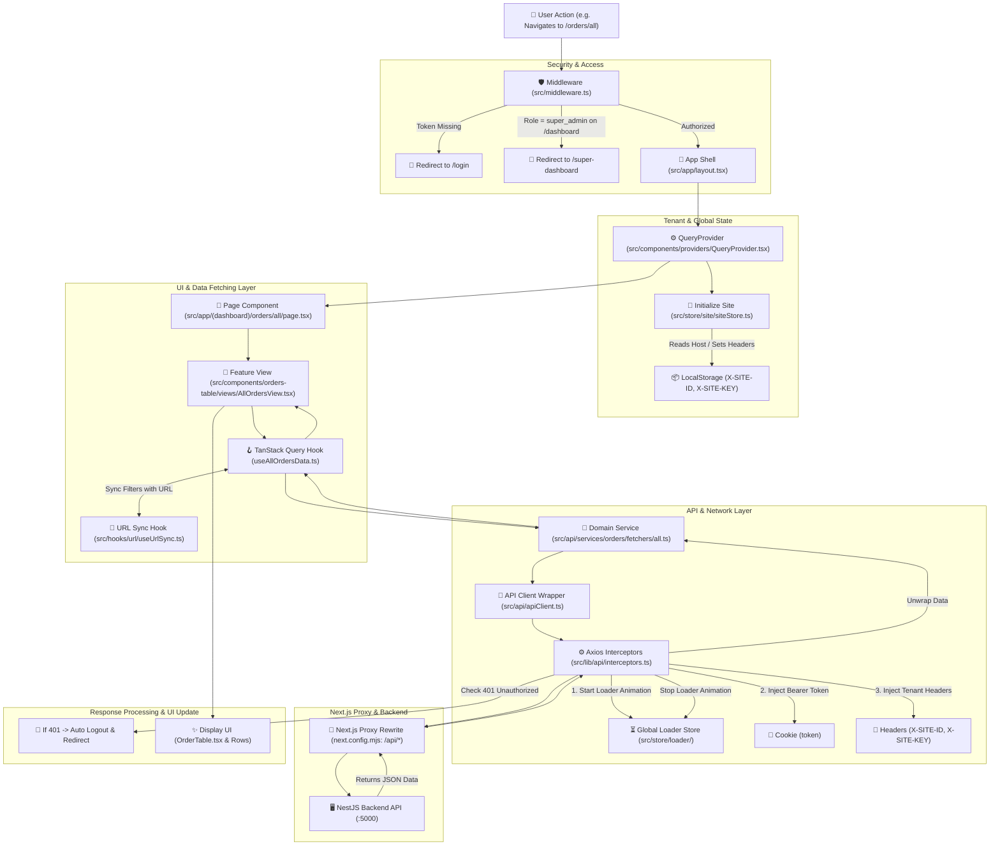
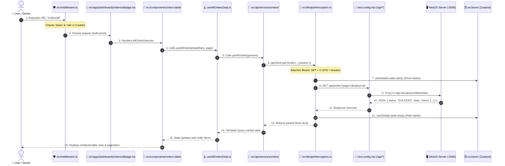

# 🚀 MediPulse End-to-End Workflow & Architecture Guide

Quick-reference document explaining how **Frontend** and **Backend** communicate file-by-file in MediPulse.

---

## 📊 1. Visual Flowchart (Overall Workflow)

---

## 🔄 2. File-to-File Step-by-Step Execution Sequence

---

## 📁 3. Directory Responsibilities Cheat Sheet

| Folder | What It Does | Example Files |
|---|---|---|
| **`src/app/`** | Next.js App Router route pages & layouts | `src/app/(dashboard)/orders/all/page.tsx` |
| **`src/middleware.ts`** | Security gatekeeper (cookies, token, RBAC redirects) | `src/middleware.ts` |
| **`src/components/`** | Visual UI components (tables, modals, cards, forms) | `src/components/orders-table/views/AllOrdersView.tsx` |
| **`src/hooks/`** | Shared React hooks (debounce, search, URL sync) | `src/hooks/url/useUrlSync.ts` |
| **`src/store/`** | Global state management via Zustand | `src/store/user/`, `src/store/site/`, `src/store/loader/` |
| **`src/api/services/`** | Clean business API endpoints | `src/api/services/orders/`, `src/api/services/customer/` |
| **`src/api/apiClient.ts`** | Axios HTTP client singleton | `src/api/apiClient.ts`, `src/lib/api/interceptors.ts` |
| **`src/types/`** | TypeScript interface definitions | `src/types/customer/`, `src/types/prescription/` |
| **`src/utils/`** | Pure helper functions | `src/utils/auth/`, `src/utils/url/`, `src/utils/branding/` |
| **`next.config.mjs`** | Proxies `/api/*` requests to NestJS Backend (`:5000`) | `next.config.mjs` |

---

## 🔑 4. Key Concepts You Should Know

### 1. Authentication (JWT Token)
* Token is stored in a cookie named `token` (and mirrored in `localStorage` as `accessToken`).
* On every API request, [`interceptors.ts`](../src/lib/api/interceptors.ts) automatically extracts this token and sends:
  `Authorization: Bearer <token>`.

### 2. Multi-Tenant Site Detection
* When a user visits the portal from any domain (e.g. `clinic1.medipulse.co.uk` or `localhost`), the frontend detects the domain via [`siteStore.ts`](../src/store/site/siteStore.ts).
* It saves `X-SITE-ID`, `X-SITE-KEY`, and `X-SITE-HOST` in `localStorage`.
* Every outgoing API request automatically includes these headers so the backend knows which tenant's database to query.

### 3. Automatic CORS Avoidance (Next.js Rewrites)
* In [`next.config.mjs`](../next.config.mjs), any request to `/api/:path*` is automatically proxied to `${NEXT_PUBLIC_API_BASE_URL}/:path*` (`http://localhost:5000`).
* Browser sees same-origin requests (`/api/...`), so **CORS errors never occur**.

### 4. Server State vs Client State
* **TanStack Query (`@tanstack/react-query`)**: Handles all backend data (orders, users, leads, customers). Caches data, handles refetching, and provides loading/error states.
* **Zustand (`src/store/`)**: Handles client-only global states (current user login, current site branding, global progress bar).
